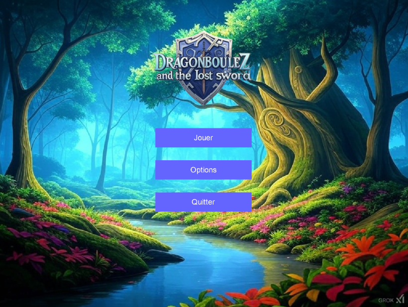
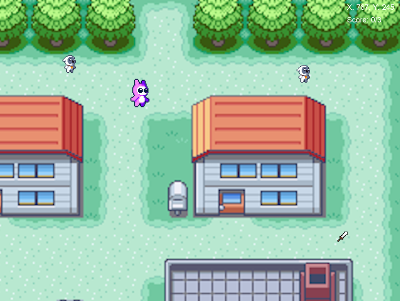

<h1>Projet Jeux Video</h1>

## 🎮 Présentation du Projet
Ce projet de jeu vidéo a été réalisé par une équipe d'étudiants en BTS dans le cadre de nos études. L'objectif était de concevoir, développer et déployer un jeu vidéo jouable, tout en mettant en pratique nos compétences en programmation, graphisme, game design et gestion de projet.

### 🌟 Caractéristiques principales
- **Genre** : RPG
- **Plateforme** : Windows
- **Technologies utilisées** :
  - Moteur de jeu : SDL2. / SDL_TTF / SDL_MIXER
  - Langage de programmation : C
  - Outils graphiques : Photoshop
- **Durée de développement** : 7 semaines

---

## 🎯 Objectifs pédagogiques
Ce projet nous a permis de :
- Appliquer les concepts de développement logiciel (conception, programmation, tests).
- Travailler en équipe selon des méthodologies agiles (gantt , padlet).
- Développer des compétences en game design et storytelling.
  

---

## 📖 Règles du jeu

- L'objectif est de collecter tous les épées et de tuer les ennemis.
- Utilisez les touches zqsd pour vous déplacer et clique gauche pour attaquer.

---

## 📸 Aperçu

---

---

## 👥 Équipe
- **Dylan** 
- **Haik** 
- **Frank** 
- **Josué**

---

## 🛠️ Fonctionnalités futures
- Ajouter de nouveaux niveaux
- Un système de gestion de sauvegarde

---

## 📝 Remerciements
Nous tenons à remercier :
- **Madame Pauly** pour son accompagnement.
- Nos camarades pour leur soutien.

---

---
